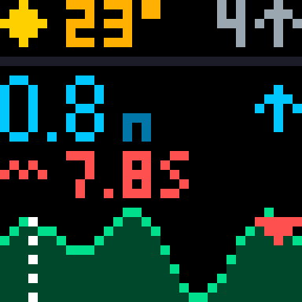
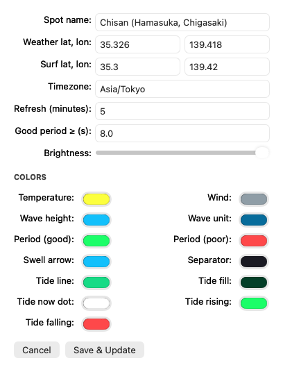

# SurfPixel 🌊

Live weather, wave and tide forecast on a desk-sized LED matrix — so you know
whether to grab the board before you've had coffee.

<p align="center">
  
</p>

SurfPixel fetches the marine forecast for your surf spot, renders it into a
single dense 32×32 frame with hand-made pixel fonts, and pushes it to an
**iDotMatrix** LED display over Bluetooth — refreshed every few minutes,
no phone app required.

## What's an iDotMatrix?

[iDotMatrix](https://www.aliexpress.com/w/wholesale-idotmatrix.html) is a
family of inexpensive LED pixel displays (16×16, 32×32, 64×64) sold on
AliExpress, Amazon and elsewhere, normally driven by a phone app of the same
name. There's no Wi-Fi and no cloud — the panel is a dumb Bluetooth LE device
that accepts commands on a single GATT characteristic. The community
reverse-engineered the protocol (see
[python3-idotmatrix-library](https://github.com/derkalle4/python3-idotmatrix-library)),
which means anything that speaks BLE can own the screen. SurfPixel renders a
PNG and sends it raw:

- device advertises a name starting with `IDM-`
- writes go to characteristic `FA02`, no response
- `[5, 0, 4, 1, 1]` enters DIY draw mode, `[5, 0, 4, 128, n]` sets brightness
- the PNG is chunked and prefixed with a small length header — that's it

## The screen

Designed for a surfer's glance: waves and tide get the pixels, weather gets a
corner.

| Zone | Rows | Content |
|---|---|---|
| Weather strip | 0–4 | condition icon, air temperature °C, wind speed (m/s) + direction arrow |
| Wave height | 8–14 | significant wave height in meters, big — plus the swell's travel-direction arrow |
| Swell period | 16–20 | `~` glyph + period in seconds — **green** when ≥ your "good" threshold (default 8 s), **red** when it's short wind chop |
| Tide | 22–31 | sea level curve, 1 pixel per hour (3 h back → 28 h ahead), white dot = now, ↑/↓ = rising or falling |

Forecast data comes from [Open-Meteo](https://open-meteo.com)'s weather and
marine APIs — free, no API key.

## macOS menu bar app (recommended)

A native Swift app — no Python, no terminal. It lives in the menu bar as a
small wave icon and keeps the display updated in the background.

**[⬇ Download the latest release](https://github.com/gancim/SurfPixel/releases/latest)**
(universal binary, macOS 13+). The app isn't notarized, so on first launch
right-click → Open, or run
`xattr -d com.apple.quarantine /Applications/SurfPixel.app`.

Or build it yourself:

```bash
cd SurfPixelApp
./build_app.sh
open dist/SurfPixel.app
```

macOS will ask for Bluetooth permission on first run; the display must be
powered on and in range (the app remembers it for instant reconnects).

Menu: **Update Now** · **Preview Frame** (see the frame without the device) ·
**Settings…** · **Start at Login**. Settings covers everything: spot name,
weather and surf coordinates, timezone, refresh interval, brightness, the
good-period threshold, and a color well for every element on screen. Stored at
`~/Library/Application Support/SurfPixel/config.json`.

<p align="center">
  
</p>

Requires macOS 13+ and Xcode command line tools to build.

## Python CLI

The same screen, scriptable — handy for a Raspberry Pi sitting next to the
display.

```bash
python3 -m venv .venv
.venv/bin/pip install -r requirements.txt

.venv/bin/python -m surfpixel --preview out.png   # render without the device
.venv/bin/python -m surfpixel --scan              # find your display
.venv/bin/python -m surfpixel --once              # push one frame and exit
.venv/bin/python -m surfpixel                     # run forever
```

Configuration lives in [config.yaml](config.yaml): coordinates, brightness,
refresh interval, the good-period threshold, and every color.

> The default spot is Chisan (Hamasuka, Chigasaki, Japan) — point
> `location.weather` and `location.surf` anywhere on a coast. The surf
> coordinates must be over water for the marine model to resolve.

## How it works

```
Open-Meteo weather API ─┐
                        ├─→ 32×32 renderer ─→ PNG ─→ Bluetooth LE ─→ iDotMatrix
Open-Meteo marine API ──┘    (pixel fonts,
 (waves, tide)                icons, tide curve)
```

Both implementations draw the identical frame: a 3×5 pixel font for small
text, 4×7 digits for the wave height, 5×5 weather icons and direction arrows,
and an auto-scaled tide sparkline. The Swift app uses CoreBluetooth and
CoreGraphics; the Python CLI uses [bleak](https://github.com/hbldh/bleak) (via
the idotmatrix library) and Pillow.

## Credits

- [python3-idotmatrix-library](https://github.com/derkalle4/python3-idotmatrix-library)
  by @derkalle4 and contributors — the reverse-engineered protocol
- [Open-Meteo](https://open-meteo.com) — excellent free weather and marine
  forecast APIs

## License

[MIT](LICENSE)
